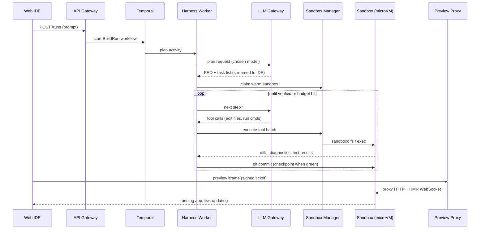

# Architect 2.0 — Technical Architecture

---

## 1. Summary

Architect turns a prompt into a deployed, agentic full-stack app. Under the hood that means five hard systems problems: **running untrusted AI-written code**, **driving an LLM reliably through a long multi-step build**, **staying model-agnostic**, **showing a live preview that never breaks**, and **shipping the result to production** — for thousands of concurrent users.

My proposal rests on five decisions:

| # | Decision | Product reason |
|---|---|---|
| 1 | **One Firecracker microVM per project (E2B)**, paused when idle, behind a swappable provider interface | Safe by default; previews survive coffee breaks; no vendor lock-in |
| 2 | **Agent harness runs outside the sandbox** as durable **Temporal** workflows | No secrets in untrusted code; a crashed sandbox or pod doesn't lose the user's run |
| 3 | **Canonical model layer + LiteLLM gateway + certification evals** | "Switch models" becomes a guarantee backed by tests, not a hope |
| 4 | **Three proxies on the three trust boundaries** (preview in, egress out, models) | One place each for auth, secrets, metering and policy |
| 5 | **Scale-to-zero runtime (Knative + gVisor) and cell-based platform on EKS**, installable in a customer VPC | Cheap to host long-tail apps; enterprise-ready from day one |

---

## 2. How architect.new works today

Findings from Lyzr's public docs and changelog. Items marked *(inferred)* are my reading of the evidence, not documented facts.

| What the docs / changelog say | What it tells us about the architecture |
|---|---|
| Build flow is Plan → Build → Refine → Deploy; a QA loop re-runs code and rewrites it on type-check or console errors before showing the app | There is a verify-and-fix loop, triggered by build and runtime errors |
| v2.2.0 adds a testing agent that checks the app in a real browser and fixes errors itself (adds ~2–5 min per build) | Browser-level verification exists but is an opt-in, slow extra step |
| v2.1.0 improves "the in-sandbox harness" | The agent loop runs **inside** the sandbox *(inferred: model keys and loop state live there too)* |
| v2.0.2: preview sandbox now stays alive at least 10 minutes when the user steps away | Sandboxes are short-lived; no pause/resume with memory |
| v2.2.0 fixes previews stuck on "Connection lost", "401 / invalid sandbox", apps not serving on the preview port | The preview path is tightly coupled to sandbox lifecycle *(inferred)* |
| Each app gets a managed NoSQL database; v2.1.0 isolates one database per app | Data layer is document-based, now tenant-isolated |
| GitHub: user authorises Architect, every change is auto-committed; v2.2.0 adds deploy via a platform-owned GitHub and import of Next.js repos | Git is the persistence backbone; broad OAuth-style grant for user repos |
| Model choice is automatic, overridable per agent in Lyzr Studio | Runtime agents are model-configurable; builder model choice is not user-facing |
| v2.2.0 shows per-phase credit usage (Plan, Agent Creator, UI Generation, Build, Testing) from "the sandbox's credit ledger" | Metering is computed close to the sandbox |
| Enterprise customers can deploy in a private VPC on AWS, Azure or GCP | Everything must be portable, not tied to one managed vendor |

**How peers run generated code:** bolt.new runs it in the user's browser (WebContainers), v0 in Firecracker microVMs (Vercel Sandbox), Lovable in per-project cloud preview containers. Open-source clones mostly use E2B.

**Gaps Architect 2.0 should close:** fragile previews, short-lived sandboxes, secrets living next to untrusted code, users paying for the agent's own fix loops, broad GitHub grants, and a builder that isn't user-switchable across models.

---

## 3. Goals, non-goals and success metrics

**Goals**
- Any user can go from prompt to a working, previewable app without touching infrastructure.
- Developers get real code, real Git, real control (import, branches, PRs, CLI/MCP access).
- Users can switch builder and runtime models without breaking their project.
- The platform is safe to run untrusted code for thousands of tenants and installable in a customer VPC.

**Non-goals (v2.0)**
- Mobile-native app generation, GPU workloads inside sandboxes, arbitrary languages beyond the TypeScript/Python templates.

**Success metrics (targets I would hold the design to)**

| Metric | Target |
|---|---|
| Time to first preview (new project) | p50 < 60 s, p95 < 2 min |
| Preview availability once "ready" | ≥ 99.9% |
| Wake time for a paused project | p95 < 2 s |
| Build success rate (reaches runtime-verified state without user help) | ≥ 85% on the golden eval suite |
| Runs lost to infrastructure failure | ~0 (durable execution) |
| Cost per successful build | tracked per model; must not regress on release |
| Model switch mid-project | zero breaking errors across certified models |

---

## 4. Architecture at a glance

The system is split into **planes**, each with a clear job:

| Plane | Responsibility | Key tech |
|---|---|---|
| **Clients** | Web IDE (chat, editor, preview, agent graph), CLI/MCP server, end users of deployed apps | Next.js, React, Monaco |
| **Edge** | DNS, WAF, TLS, CDN, custom domains | Cloudflare (+ Cloudflare for SaaS) |
| **Control plane** | APIs, realtime events, orchestration, the agent harness, Git, deploy, secrets, metering, evals | EKS, FastAPI, Temporal, Redis |
| **Proxy layer** | The three trust boundaries: preview in, egress out, model calls | Envoy, LiteLLM |
| **Sandbox plane** | One isolated microVM per active project where code is written, run and tested | E2B (Firecracker) |
| **Runtime plane** | Hosting deployed apps and their agents and data | Knative, gVisor, Neon, Lyzr Studio agents |
| **Data** | Metadata, event streams, files, usage ledger, secrets, telemetry | Aurora Postgres, Redis, S3, ClickHouse, Vault, OTel |

### Request lifecycle: from prompt to preview

---

## 5. Sandboxes — where each user's app runs

**Decision:** one **E2B Firecracker microVM per active project**, built from pre-baked templates, **paused when idle and auto-resumed on activity**, accessed only through a `SandboxProvider` interface.

**How it works**
- Templates (`nextjs-fastapi`, `vite-react`, `python-agent`) ship with dependencies, toolchain, headless Chromium + Playwright, and a small daemon, `sandboxd`, that exposes a tool API (filesystem, exec, terminal, file-watch, port events, diagnostics).
- A **warm pool** of pre-booted sandboxes per template means a new project is "claim + write files", not "boot + install".
- When idle, the sandbox pauses with memory and filesystem preserved. A preview request or agent step resumes it — E2B supports auto-resume when an HTTP request hits a paused sandbox, which is exactly the "user stepped away and came back" case.
- **The sandbox is disposable.** Every green step is a git commit; files and artifacts go to S3. A lost sandbox is rebuilt from template + git in seconds.

**Why microVMs**
AI-written code is untrusted. Containers share the host kernel; a Firecracker microVM gives each project its own guest kernel, so an escape lands in a throwaway VM rather than on shared infrastructure.

**Alternatives considered**

| Option | Why not (as the default) |
|---|---|
| WebContainers (in-browser) | Can't run Python backends, real DB clients, or browser-based testing; state lives in the user's tab |
| Docker on our own nodes | Shared kernel — only appropriate for human-reviewed code |
| Modal (gVisor) | Great for bursty/GPU work, but no in-place pause/resume and a weaker boundary than a microVM |
| Vercel Sandbox | Firecracker, but couples us to Vercel; resident sandboxes get expensive for long sessions |
| Daytona | Strong and fast; kept as the **second provider** behind the interface |
| Self-run Firecracker | Cheapest at very high steady volume, but means building snapshots, networking and scheduling ourselves — a later cost lever |

**Trade-offs and mitigations**
- *Cost:* E2B and Daytona charge for the full time a sandbox is alive (≈ $0.0504/vCPU-hr and $0.0162/GiB-hr). → Aggressive pause-on-idle, right-sized templates, and the provider interface to move steady load to cheaper infrastructure later.
- *Vendor dependence:* → provider interface; E2B BYOC and self-hosting for enterprise VPCs.

---

## 6. The agent harness — plan, code, run tools, recover

**Decision:** a **model-agnostic harness running in the control plane**, orchestrated by **Temporal**, executing tools inside the sandbox via `sandboxd`.

**Why outside the sandbox (a change from today)**

| Benefit | Detail |
|---|---|
| Security | Model API keys never enter the untrusted environment |
| Durability | If the sandbox dies, the run doesn't — it resumes against a rebuilt sandbox |
| One place to switch models | Adapters, prompts and loop logic live in one versioned service |
| Cheaper waiting | While the model thinks or the user reviews a plan, the sandbox can be paused |

This mirrors how Anthropic runs Claude Managed Agents on customer-hosted Daytona or E2B sandboxes: the loop stays on one side, and only file and shell tools execute in the sandbox. The cost is one extra network hop per tool call, mitigated by batching.

**How the loop works**

| Stage | What happens |
|---|---|
| **Plan** | Clarifying questions → PRD → task graph. Cost/time estimate is computed from the task graph, not guessed by the model. User can approve or edit. |
| **Code** | Patch-based edits (search/replace), each returning a diff and fresh diagnostics. Parallel sub-tasks with file locks for large builds. |
| **Verify** | A ladder of checks, cheap to expensive: format → type-check/lint → build → server boots and returns 200 → preview loads in headless Chromium with no console errors → Playwright flows from the PRD's acceptance criteria. |
| **Fix** | Errors are classified first (tool error, build error, runtime error, environment error, provider error) so only real code problems go to the model. |

**Error recovery policy**
1. Up to 3 repair attempts per distinct error signature (hashed message + file + stack frame).
2. Escalate to a stronger model, with a summary of failed attempts.
3. Revert to the last green checkpoint and re-plan the task differently.
4. Ask the user, with a short diagnosis and 2–3 options.

Hard budgets on steps, tokens, time and credits stop runaway loops. **Product decision:** repair loops past the first escalation aren't billed to the user — the platform absorbs the cost of its own mistakes, which also gives us the incentive to fix them.

**Tools and permissions:** read tools run freely; change tools run in the sandbox; **irreversible tools** (deploy, sending email through a connector, destructive migrations) always require explicit user approval.

**Context management:** a stable prompt prefix (system prompt, tool schemas, repo map) for provider prompt caching; persistent memory files in the repo (`PRD.md`, `AGENTS.md`) that also make the project portable to Claude Code or Cursor; compaction at ~70% of the context window.

**How we take care of it in production**
- Harness code, prompts and tool schemas are versioned together; every run records the versions it used.
- A **golden eval suite** (~300 prompts across CRUD apps, RAG apps, multi-agent workflows, imported repos, bug fixes) runs nightly per model and gates every release.
- Canary rollouts by percentage of runs, auto-rollback on success-rate or cost regressions, per-model and per-tool kill switches.
- Every run is traced end to end (Langfuse + OpenTelemetry) and can be replayed from its transcript.

---

## 7. Model-agnostic — switch models without breaking anything

There are two model choices to support: the **builder** model (writes the code) and the **runtime** model (used by the generated app's agents).

**Decision:** four layers.

| Layer | Role |
|---|---|
| **Canonical schema** | Conversations and tools stored in one provider-neutral format (text, image, tool call, tool result, reasoning summary; tools as JSON Schema) |
| **Adapters** | Translate to and from each provider's tool-calling, streaming and caching formats |
| **LLM Gateway (thin, in-house)** | A small internal service — not a third-party proxy — that owns fallbacks, retries, per-tenant budgets, virtual keys and cost/latency logging on top of the Adapters layer |
| **Model Registry** | Capabilities per model (tools, vision, context size), a tuned **prompt pack** and **edit format** per model family, and a status: certified / beta / blocked |

**What makes it real rather than aspirational**
- **Certification:** a model is offered for a role only after passing the eval suite above a threshold.
- **Capability-aware behaviour:** no vision → send DOM/console summaries instead of screenshots; small context → compact earlier; weaker editors → whole-file writes instead of diffs.
- **Mid-project switching:** because the transcript is canonical, the next step just goes to a different adapter. Provider-specific artefacts are dropped or summarised; the UI warns that the prompt cache resets.
- **Resilience:** fallback chains (same model on another cloud first, then a certified peer).
- **BYOK and enterprise routing:** tenant keys or customer Bedrock/Azure/Vertex endpoints are just gateway configuration.

**Runtime models:** generated code never hard-codes a provider SDK. It calls the Agent Runtime (Lyzr Studio) by agent ID, and the model is agent configuration — so an app's agents can move from GPT to Claude to an open-weights model without regenerating or redeploying code.

The gateway is internal-only, never exposed to the internet, and built and owned in-house rather than adopting a third-party proxy — its surface area is deliberately small (routing, budgets, retries, logging) so it stays easy to audit and patch, instead of inheriting a general-purpose proxy's larger attack surface and CVE history.

---

## 8. Frontend ↔ backend ↔ sandbox, including the live preview

The IDE talks to the platform through three channels:

| Channel | Transport | Used for |
|---|---|---|
| Commands | HTTPS REST via the API Gateway | send message, approve plan, save file, deploy, set env var, switch model |
| Events | One WebSocket per session to the Realtime Gateway | plan tokens, tool calls, diffs, verification results, logs, terminal, sandbox state, cost |
| Preview | The iframe's own HTTP + WebSocket traffic | the running app, hot-module reload |

**Resumable events.** The harness writes every event to a Redis Stream; the Realtime Gateway replays from the last event ID on reconnect. A network blip no longer produces "Connection lost" or a half-rendered plan.

**Editor and agent editing the same project.** User saves go through the API to `sandboxd`; agent edits emit file-watch events back to the editor. Files touched by an active run are locked in the editor with a "take over" action that pauses the run.

**Live preview path**
1. IDE requests a short-lived signed **preview ticket** from the API.
2. The iframe loads `p-3000-{sandbox}.archpreview.dev`; the Preview Proxy validates the ticket and sets a host-scoped cookie.
3. The proxy looks up the sandbox route in Redis, **wakes it if paused**, and proxies HTTP and the HMR WebSocket to the dev server.
4. When the agent writes a file, the dev server pushes the change over HMR and the preview updates in place.
5. A small dev-only plugin baked into templates sends console errors, failed requests and **click-to-select elements** back to the IDE, so "fix this" and "make this button bigger" arrive with precise context.

**Readiness is real:** "ready" is shown only when the port is listening and the page returns 200 — not when the process starts.

**Security:** previews live on a separate registrable domain from the IDE (`architect.new`) and deployed apps (`architect.app`), so untrusted app code can't read the user's Architect session.

---

## 9. The proxy layer — where it sits and what it does

Three proxies, one per trust boundary. Together they guarantee **the sandbox never holds a real credential and can only reach what we allow**.

| Proxy | Sits between | Responsibilities |
|---|---|---|
| **Preview Proxy** (Envoy + ext_authz) | Browser → sandbox | Authenticates every request, routes to the right sandbox and port, wakes paused sandboxes, carries HMR WebSockets, adds security headers, hides the sandbox vendor from users |
| **Egress & Secrets Proxy** | Sandbox / deployed app → internet | Default-deny allow-list (package mirror, GitHub, Agent Runtime, user-approved APIs); swaps placeholder secrets for real values from Vault on allowed hosts; blocks cloud-metadata and private IPs; package malware checks; per-sandbox rate limits; audit log |
| **LLM Gateway** | Harness / runtime agents → model providers | Routing, fallbacks, budgets, caching, redaction, metering (§7) |

**Secret substitution** is the key idea: the sandbox's environment only contains placeholders like `ARCH_SECRET_OPENAI`. When the app calls an allowed host, the egress proxy replaces the placeholder in the request header with the real value. Daytona documents the same pattern for model API keys in its sandboxes. A prompt injection that dumps the environment finds nothing useful, and can only send it to allow-listed hosts.

---

## 10. GitHub integration

**Decision:** a **GitHub App** (not an OAuth App), with two repo modes and event-driven two-way sync.

**Why a GitHub App:** it only accesses repositories the user selects, uses fine-grained permissions, and issues installation tokens that expire after one hour — versus OAuth tokens that live until revoked and cover everything the user can access.

**Repo modes**
- **Platform-managed (default):** repo lives in an Architect-owned org, so users can deploy with no GitHub account; "Export to my GitHub" moves it later.
- **User-owned:** user installs the app on their account/org and picks a repo.
- **Enterprise:** same `GitProvider` interface for GitHub Enterprise Server and GitLab.

**Commit flow**
1. Each green verification step is a local checkpoint commit in the sandbox.
2. End of turn: checkpoints are squashed into one readable commit and pushed to `architect/<session>`.
3. The Git Service mints a one-hour, single-repo token; the egress proxy injects it for the push, so the sandbox never sees it.
4. Solo mode fast-forwards the default branch (today's behaviour). **Team mode opens a PR** with the PRD diff and verification report.

**Two-way sync:** a push webhook from a human edit triggers a pull-and-rebase in the live sandbox (or on next resume), followed by re-verification. Conflicts are resolved by the agent with the result shown to the user.

**Import:** clone → detect stack → pick closest template → install → run → map routes, agents and required env vars → write only `architect.json` and `AGENTS.md`.

---

## 11. Deployment

### 11.1 Deploying a user's app

Deployed code is still AI-written and multi-tenant, but most generated apps get little traffic. The runtime is chosen for both.

| Step | Implementation |
|---|---|
| Gate | Deploy requires the commit to have passed end-to-end verification |
| Build | BuildKit (rootless) on Kubernetes → OCI image, SBOM and vulnerability scan → ECR |
| Data | Prod migrations on the app's **Neon Postgres** main branch (expand-only; destructive changes need approval). Preview sandboxes use a copy-on-write branch |
| Release | New **Knative** revision at 0% traffic → Playwright smoke test on its tagged URL → shift 100% traffic; previous revision stays warm |
| Rollback | Shift traffic back — seconds |
| Isolation | gVisor runtime class, namespace + network policy per app, egress through the Egress Proxy |
| Cost | Scale-to-zero for free-tier apps (first request ~1–3 s); `minScale: 1` for paid apps |
| Domains | `*.architect.app` by default; custom domains with automatic TLS via Cloudflare for SaaS |
| Agents | The app calls the Agent Runtime, which calls the LLM Gateway with the app's own virtual key |

**Why Postgres instead of today's NoSQL:** business apps are relational, and branching gives the agent a safe, realistic copy of prod data to test against. A document-style API on `jsonb` keeps existing apps compatible.

### 11.2 Deploying Architect 2.0 itself

| Area | Choice |
|---|---|
| Cloud & compute | AWS, EKS per cell, Karpenter autoscaling, separate node pools (control, harness, build, gVisor apps) |
| Regions | `us-east-1` and `ap-south-1` to start; EU when residency requires |
| Data | Aurora Postgres, ElastiCache Redis, S3, ClickHouse, Temporal Cloud, Vault + KMS |
| Delivery | Terraform + Helm + ArgoCD (GitOps); Argo Rollouts canaries; expand/contract DB migrations; feature flags per tenant and cell |
| Release path | dev → staging (full eval suite against real providers) → prod cells one at a time, canary cell first |
| Observability | OpenTelemetry → Prometheus/Grafana, Loki, Tempo; Langfuse for LLM traces |
| Enterprise VPC | Same charts and modules in the customer's AWS/Azure/GCP, with E2B BYOC, their model endpoints, their Git provider and IdP |

The IDE runs as a container behind Cloudflare rather than on a managed frontend host, so the whole product installs identically in a VPC.

---

## 12. Scaling to thousands of concurrent users

### 12.1 Capacity model (10,000 concurrent builders in one region)

| Assumption | Value |
|---|---|
| Actively running an agent at peak | 15% → 1,500 runs |
| One model call per active run every ~12 s | ~125 calls/s |
| Average prompt / output | ~35k tokens (≈85% cached) / ~1.2k tokens |
| Running (not paused) sandboxes | ~3,000 at 2 vCPU / 4 GiB |

**What this tells us:**
1. **LLM throughput is the binding constraint.** ~4.4M input tokens/s (≈0.66M uncached) is far beyond a single provider account's default limits. Mitigation: committed capacity across providers and clouds, rate-limit-aware routing, and prompt caching designed in (stable prefixes).
2. **Sandbox spend is second.** At list rates a 2 vCPU/4 GiB sandbox is ≈ $0.17/hour; 3,000 running ≈ $500/hour. Pause-on-idle and right-sizing matter more than any web-tier tuning.
3. **The control plane is not the bottleneck.** 10k WebSockets and ~125 workflow steps/s are routine for Redis, Temporal and a few pods per service.

### 12.2 Mechanisms

| Mechanism | Purpose |
|---|---|
| **Cells** | Each cell is a full stack (cluster, DB, Redis, Temporal namespace, sandbox quota) serving a tenant group. Limits blast radius, scales horizontally, supports residency and dedicated enterprise cells |
| Stateless services + autoscaling | API, realtime and preview proxy scale on load |
| Harness workers | Async and I/O-bound; scale on Temporal queue depth |
| Fair-share admission | Per-tenant concurrency caps and per-plan queues; when saturated, runs queue with an ETA instead of failing |
| Warm pools + pause-on-idle | Fast starts, low idle cost |
| Build farm | Remote cache keyed on lockfile hash; spot capacity |
| Scale-to-zero runtime | Long tail of low-traffic apps costs almost nothing |
| Degradation ladder | Under provider pressure: fall back to certified peer models → lighter verification on free tier → queue. Never drop in-flight runs |
| Load testing | Replay recorded transcripts against a staging cell with a mocked LLM to test at 2–3× peak without token spend |

---

## 13. Security model

| Threat | Control |
|---|---|
| Sandbox escape by AI-written code | Firecracker microVM per project; resource limits |
| Secret exfiltration | Placeholder secrets only; substitution at the egress proxy; default-deny egress |
| Prompt injection from web pages, repos or emails the agent reads | Tool permission tiers; human approval for irreversible actions; egress allow-list limits where data can go |
| Preview or app code stealing IDE sessions | Separate registrable domains for IDE, previews and apps; frame-ancestors CSP |
| Over-broad repo access | GitHub App, single-repo tokens valid for one hour |
| Malicious packages | Mirrored registries with malware/typosquat checks; SBOM on every build |
| Abuse of deployed apps | Signup risk scoring, deploy-time phishing scans, CPU/egress anomaly detection |
| Cross-tenant data access | Per-app database and role; row-level security via the app SDK; tenant ID enforced in every control-plane query |

---

## 14. Risks and open questions

| Risk / question | Mitigation / next step |
|---|---|
| A custom harness may trail vendor-tuned agents (Claude Code, Codex) on their own models | Keep the tool/permission layer generic; evaluate a "native harness" mode per certified model family |
| Provider capacity is a business dependency | Multi-provider contracts negotiated early; the gateway makes routing a config change |
| TLS interception for secret substitution breaks SDKs that pin certificates | Route those integrations through server-side connectors instead of from the sandbox |
| gVisor incompatibility with some native modules | Keep a microVM runtime class as fallback for affected apps |
| Migration from NoSQL to Postgres for existing apps | Document-style compatibility API on `jsonb`; migrate on next deploy |
| Verification adds latency (browser tests take minutes) | Adaptive: always before deploy, sampled on free-tier iterations |

---

## 15. Phased delivery

| Phase | Scope | Exit criteria |
|---|---|---|
| **0 — Core loop** (weeks 1–6) | IDE, API, resumable events, Temporal, harness (plan → code → verify up to preview load), E2B provider, Preview Proxy, LiteLLM with 2 certified models, platform-managed GitHub | Prompt reaches a working preview; runs survive pod and sandbox restarts |
| **1 — Trust & ship** (weeks 7–12) | Egress & Secrets Proxy, GitHub App user mode + PR mode, Neon + app SDK, Knative/gVisor deploys with rollback, metering ledger, eval gate in CI | One-click deploy with rollback; no real secrets in sandboxes; every harness change eval-gated |
| **2 — Scale & choice** (months 4–6) | Cells, warm pools, fair-share admission, 5+ certified models incl. open-weights, BYOK, repo import, CLI + MCP server | 10k concurrent builders in load test; model switch mid-project with zero breaking errors |
| **3 — Enterprise & cost** (months 6–9) | VPC install, E2B BYOC, GitHub Enterprise/GitLab, SSO/SCIM, self-run Firecracker for steady load | First VPC customer live; sandbox cost per active hour reduced |

---

## 16. Service catalogue

| Service | Tech | Why this choice |
|---|---|---|
| Web IDE | Next.js, React, Monaco, React Flow | Mature ecosystem for editor-heavy UIs; containerised for VPC parity |
| API Gateway / BFF | FastAPI, async SQLAlchemy, JWT/OIDC | Typed, async, fast to build; one front door for auth and tenancy |
| Realtime Gateway | WebSocket + Redis Streams | Push updates with replay on reconnect |
| Auth & Tenancy | OIDC/SAML (e.g. WorkOS or Keycloak), RBAC | Enterprise SSO/SCIM out of the box |
| Run Orchestrator | Temporal | Durable, resumable multi-minute workflows with human-in-the-loop signals |
| Agent Harness Workers | Python (async) | Model-agnostic loop; scales on queue depth |
| Model Registry | Postgres + admin UI | Capabilities, prompt packs, certification status as data |
| Sandbox Manager | Go | Provider interface, warm pools, lifecycle, routing |
| Sandboxes | E2B (Firecracker) | Hardware isolation, pause/resume, auto-resume, BYOC |
| Preview Proxy | Envoy + ext_authz | Auth, routing, wake-on-request, WebSockets |
| Egress & Secrets Proxy | Envoy + policy service | Allow-list, secret substitution, audit |
| LLM Gateway | LiteLLM (self-hosted) | Multi-provider routing, budgets, fallbacks; runs in VPCs |
| Git Service | GitHub App + provider adapters | Least-privilege, short-lived tokens, webhooks |
| Deploy Service | BuildKit + Knative API | Reproducible builds, revisions, instant rollback |
| App runtime | Knative + gVisor | Scale-to-zero plus an extra isolation layer, portable to any Kubernetes |
| App database | Neon Postgres (CloudNativePG in VPC) | Per-app isolation, branching for safe testing |
| Agent Runtime | Lyzr Studio agents API | Reuses Lyzr's core asset; model is configuration |
| Secrets | Vault + KMS | Central secrets, OAuth tokens, BYOK |
| Metering | ClickHouse | High-volume usage ledger for per-phase cost views |
| Observability | OpenTelemetry, Grafana stack, Langfuse | End-to-end traces including LLM calls |

---

## 17. Sources

**Lyzr Architect**
- Introduction — https://docs.architect.new/introduction/overview/introduction
- Database & Authentication — https://docs.architect.new/build/database-auth.md
- Deployment & Publishing — https://docs.architect.new/build/deployment.md
- Connecting Your GitHub — https://docs.architect.new/build/github-connect.md
- FAQs — https://docs.architect.new/references/faqs.md
- Release notes — [v2.0.2](https://docs.architect.new/changelog/v2-0-2.md) · [v2.1.0](https://docs.architect.new/changelog/v2-1-0.md) · [v2.2.0](https://docs.architect.new/changelog/v2-2-0.md)

**Industry and infrastructure**
- Where Lovable, bolt.new and v0 run generated code — https://bex.co/blog/2026/09/12/where-lovable-bolt-v0-run-generated-code
- E2B auto-resume — https://e2b.dev/docs/sandbox/auto-resume · E2B BYOC — https://docs.e2b.dev/byoc
- Sandbox platform comparison (LogRocket) — https://blog.logrocket.com/comparing-ai-agent-sandbox-platforms-e2b-modal-daytona-and-more/
- Claude Managed Agents on Daytona — https://www.daytona.io/dotfiles/claude-managed-agents-on-daytona
- Daytona secret substitution — https://www.daytona.io/docs/en/guides/claude/claude-agent-sdk-interactive-terminal-sandbox/
- LiteLLM — https://github.com/BerriAI/litellm · https://docs.litellm.ai/blog
- GitHub Apps vs OAuth Apps — https://docs.github.com/en/apps/oauth-apps/building-oauth-apps/differences-between-github-apps-and-oauth-apps
